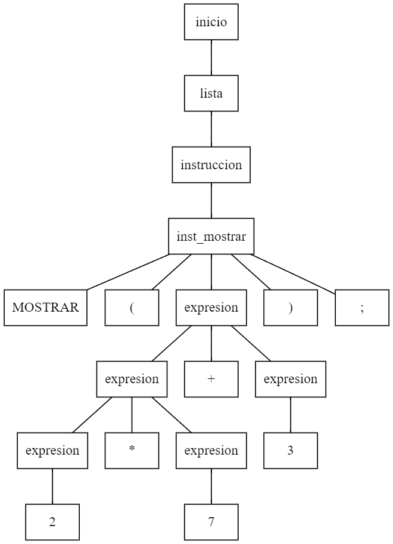

## Terminales :
```
ENTEROS
+
-
*
/
MOSTRAR
(
)
;
```


## No Terminales
```
inicio
expresion
lista_instruccion
instruccion
inst_mostrar
```

## Precedencia
```
+, -
*, /
```

## Simbolo Inicial
inicio

## Producciones
```
inicio ::= lista 

lista::= lista instruccion 
	| instruccion 	

instruccion ::= inst_mostrar

inst_mostrar ::= MOSTRAR ( expresion ); 	

expresion ::= expresion + expresion	
	|  expresion - expresion		
	|  expresion * expresion
	|  expresion / expresion		
    |  ENTERO	
```			


## Árbol de Análisis Sintáctico
### Entrada: 
```
MOSTRAR ( 2*7+3 );
```
### Árbol de Análisis Sintáctico Resultante:
