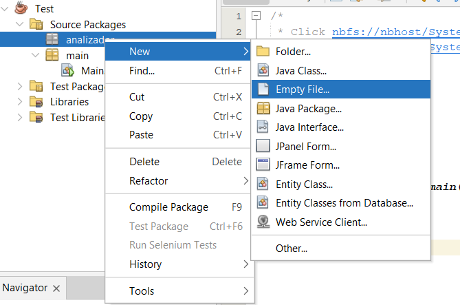

# Ejemplo Simple de JFlex y Cup

## 1. Instalar Apache Neatbeans y el JDK 
<h3> Primero debes instalar el JDK en tu computadora:

https://www.oracle.com/java/technologies/downloads/#jdk20-windows

Luego debes instalar Apache NetBeans:
https://netbeans.apache.org/

## 2. Crear Nuevo Proyecto

Crea un proyecto nuevo de Java utilizando Java with Ant y luego Java Application.


## 3. Agregar Librerias JFLEX y Cup

Link de Descarga JFlex y Cup: https://drive.google.com/file/d/1S9MRlNVIhQ6HTyij20Y20AYi-W7N9dFX/view?usp=sharing

Al lado izquierdo de nuestro IDE encontraremos nuestro proyecto. Buscaremos la carpeta Libraries y daremos clic derecho.


Luego utilizaremos la opción Add JAR/Folder


Buscamos en nuestra computadora la carpeta donde se encuentran los .jar de las librerías.


Si todo esta correctamente ahora en la carpeta Libraries te deberían aparecer los tres .jar


## 4. Crear Archivos de Configuracion

Debes crear un nuevo paquete que se llame "analizador" y dentro debes crear dos Empty File llamados "Lexer.jflex" y "Parser.cup"



Luego copia en su respectivo archivo los contenidos de [Lexer.jflex](./Lexer.jflex) y [Parser.cup](./Parser.cup)


## 5. Generar los Analizadores

En tu clase Main debes agregar la siguiente función:

```java
public static void analizadores(String ruta, String jflexFile, String cupFile){
        try {
            String opcionesJflex[] =  {ruta+jflexFile,"-d",ruta};
            jflex.Main.generate(opcionesJflex);

            String opcionesCup[] =  {"-destdir", ruta,"-parser","Parser",ruta+cupFile};
            java_cup.Main.main(opcionesCup);
            
        } catch (Exception e) {
            System.out.println("No se ha podido generar los analizadores");
            System.out.println(e);
        }
    }
```

Y luego en tu función Main debes tener el siguiente codigo:

```java
public static void main(String[] args) {
    String entrada = "25"; // Puedes modificar esta entrada
    
    // Generar Analizadores
    analizadores("src/analizador/", "Lexer.jflex", "Parser.cup");
    
    // Realizar Analisis
    try {
        analizador.Parser parser = new Parser(new analizador.Lexer(new StringReader(entrada)));
        parser.parse();

    } catch (Exception ex) {
        System.out.println("Error fatal en compilación de entrada.");
    }  
}
```

### NOTA: 
EL analizador es un ejemplo Sencillo para reconocer **UN NUMERO ENTERO**.
